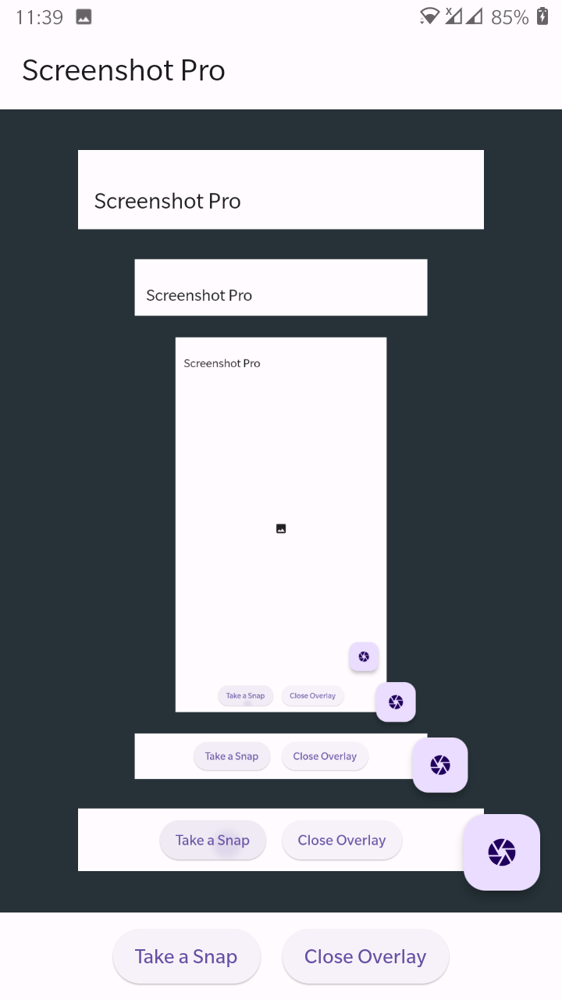

## screenshot_plus
Screenshot Plus is a Dart package for taking screenshots on Android and iOS. It provides a native way for taking screenshots of the entire screen.This plugin saves the image and returns the path.Also working on any version of **Android** or **iOS**.


## Preview




## Instalation

Run this command in terminal:

```
flutter pub add screenshot_plus
```
Or add this on `pubspec.yaml` file.

```
screenshot_plus:
```


### Android
You must grant Write permission on Storage

```
<uses-permission android:name="android.permission.WRITE_EXTERNAL_STORAGE" />
```

to your `AndroidManifest.xml` inside `android/src/main/` directory.

Also you need to add a property to `application` tag to fix an issue with permissions writing to `EXTERNAL_STORAGE`:

```
android:requestLegacyExternalStorage="true"
```

### iOS
If don't add

```
<key>NSPhotoLibraryAddUsageDescription</key>
<string>Take pretty screenshots and save it to the PhotoLibrary.</string>
```

to your `info.plist` file inside `ios/Runner` directory, the application will crash.

## Use

Import the library:

```
import 'package:screenshot_plus/screenshot_plus.dart';
```

and take a screenshot:

```
//Get the absolute path
String path = await ScreenshotPlus.takeShot() ?? '';
debugPrint('Screenshot taken @: $path');
```

In error case the function returns `empty path` to Show the captured image use this widget

```
//image Filepath is the absolute file path
Image.file(imageFilepath)
```


## Acknowledgments
This is based on [native_screenshot](https://pub.dev/packages/native_screenshot) packages with Fixing the compatible issue and also supporting Android 13. Special Thanks To Him.

## 🔗 Follow
[](https://arrahmanbd.github.io/)
[](https://www.linkedin.com/arrahmanbd)